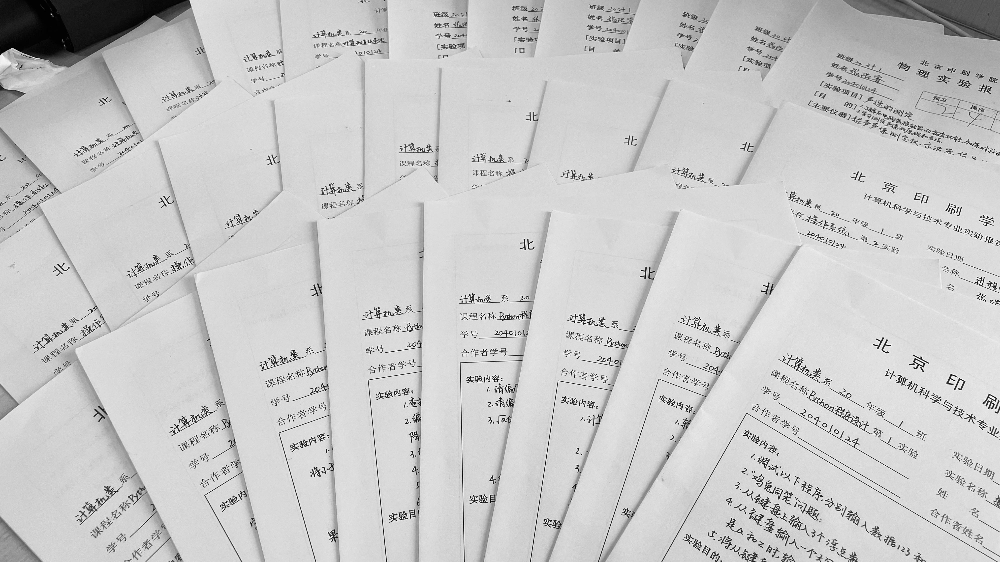

## Summary of the 25&26 week

> 天光微现。

两周过去，又是好久不打卡。我在做些什么呢？天光微现，未来日子的晴雨表我又是怎样窥见一斑的呢？这篇周总结里我就大概说一说吧；还有，面临着假期阶段体能与精神的现实状况，我的新点子也在这篇文章里讲一讲。

##### 注：自本周起，个人的周总结分为中英文两个版本。中文和英文大意相同，但英文版并非为中文的纯翻译版，同样具有可读性，欢迎阅读（英文版看时间安排，更新会稍微延迟一些）。

- 寻宝——窥见一斑

这两周多的日子里我一直在处理我的学业。那么截至今天，我这学期的课堂任务（平时作业、实验、期末大作业）完成了一大半了。趁热打铁，十一小长假我要做到完成全部作业的80%左右（因为有些作业老师是每周留的而且要不来，只能每周跟着写了）。

那么很清楚的一个成果，就是我那不算多也不算少的40篇实验报告。



<center>一个平常的小任务，却在这个阶段具有了象征性的意味。</center><center>(图内仅为需要用笔写的一些)</center>

我解决学业问题，看来还是要分两部分说。

一部分是0920-0930的中秋节+国庆“战役”预备阶段：

准备高数、电路的补考；正常上课并完成该周相应作业。

另一部分是1001-1003的国庆“战役”前半部分：

写40份4+1科的实验报告（有1科被迫不能全写完，手里没资料），准备完成四科的作业。

```txt
这是任务清单：
 · 实验报告
 	操作系统 Python 网站开发技术 计算机英语 Java
 · 作业
 	英语综练+长篇后半部分
 	马原读书报告
 	物理作业 概统作业
```

最近这三天的坚持让我在接下来的四天里取得了更多的主动权，可预见的是，在不久的将来，我就可以按照我的学习规划按部就班地向前突击了。

这个学期的规划是有的，但是在总目标不变、基本目标必须保障的情况下，我还要根据每周不同的形势做出相应的调整部署，这里的版本仅供参考。

```txt
- 第一阶段：
    概统/数电
    Python/Java(生活&&API)/OS/.NET/计英
    
- 第二阶段：
    线代/离散（入门）
    雅思/政治
    计组/DS/Nwk/编译/汇编
    Linux/安卓
    
- 第三阶段：
    高数/线代 ～重点
    复变/离散 ～深入
    
    (下面的目的是：挖掘做国外Lab的能力)
    国外课程：
    	OS-6.828/Distributed_Systems-6.824/
    	Compiler-6.035/CSIntro-CS50
    	造轮子——模仿现有组件自己造
    Linux Coding && Network Coding
    
    尝试挣一波Lab……不现实的想法，只能说试试看
    
    （远期规划，未定）
```


天光微现，红日当出。

藏宝图一角的尘埃已被我一点点扫开，窥见一斑，却满心欢喜。


- 进入深水区——体能与心理的重新分布与合理规划利用

国庆“战役”打响之后，我遇到了许许多多新老问题：

1. 精神上变得懒惰了起来，心理上想要“休息”——即不做学习有关的事——的心态变得强烈了起来（而生理上并没有疲惫的迹象）。这就导致我早起起床会晚于平日，从早晨六点拖延到了七点半甚至到了八点。当有两三个小时能学习的时候，会产生一点抗拒的心理。
2. 外界的条件对我维持正常的作息产生负面影响——即我校的图书馆开放时间仅为`8:30 -- 16:30`。我不得不舍弃午休的一个半小时来争取更多的在图书馆的学习时间，然后把午休（吃饭、洗澡）的时间移动到`16:00`之后。然后晚上再去西红门咖啡厅学习三四个小时。此外，在第二天、第三天的上午，由于困意还是有一些，造成了写实验报告拿不动笔的严重情况。
3. 整个环境氛围还是有明显的改变的，十一放假，大家都在游玩或是回家休息，我呢，奔波于图书馆和咖啡厅之间，坚守本心会更难一些。今天晚上回学校的时候，在地铁上感受到自己很疲惫（心累）。

虽然存在这些问题，但是我想了一些办法来保持我的冲劲——正好明天图书馆开放时间变为正常，更有利了。

1. 早起起床的闹钟听见以后，打开一个很热闹的歌单，用快节奏把自己从睡眠状态带醒。
2. 开始坚持学习专业课程——专业课是我永远的爱，它就是原生的动力。
3. 严格执行日记制度。
4. 可以适当增加一些睡眠时间（比如10点休息），但六点早起不能动摇。
5. 恢复傍晚的“遛弯”活动，保持良好的身体机能，保持良好的精神状态——但要改为每周3次左右。
6. 禁止使用B站、知乎、微博等App（除了听课学习查资料，且查资料必须要有时间限制），限制图书馆环境下的音乐范围（即只能听轻音乐或一些轻松的学习歌单），目的是保持专注。
7. 出了图书馆爱听啥听啥。
8. 略减少一些特定时段的沟通吧（上面几条已经将客观条件限制住了）——目的也是保持学习期间的专注。
9. 可以安排一定的时段来娱乐，但时间不能太长，最多一个小时；或是头脑风暴，打开思路查找一些东西。

总的目的，是保持一个比较低阈值的大脑兴奋状态，让自身在学习上更加的专注，且保持一个良好的能够支持这些消耗的体能与平静的心情。


这就是本次周总结的全部内容，感谢看完。

##### 花絮：祝40天快乐。

24:00 10/03/2021 by 张瀚哲

