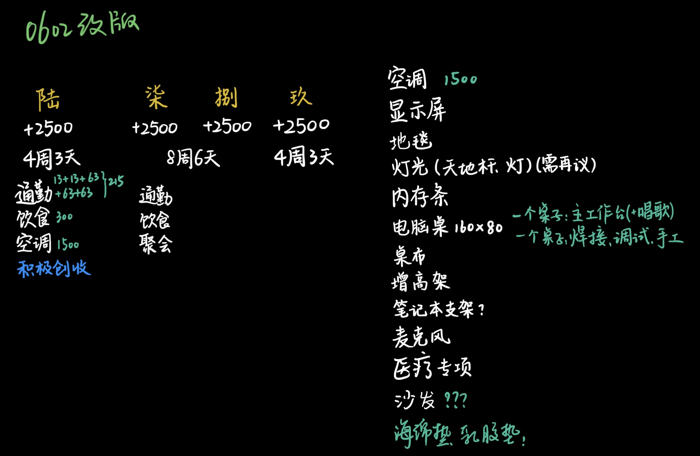
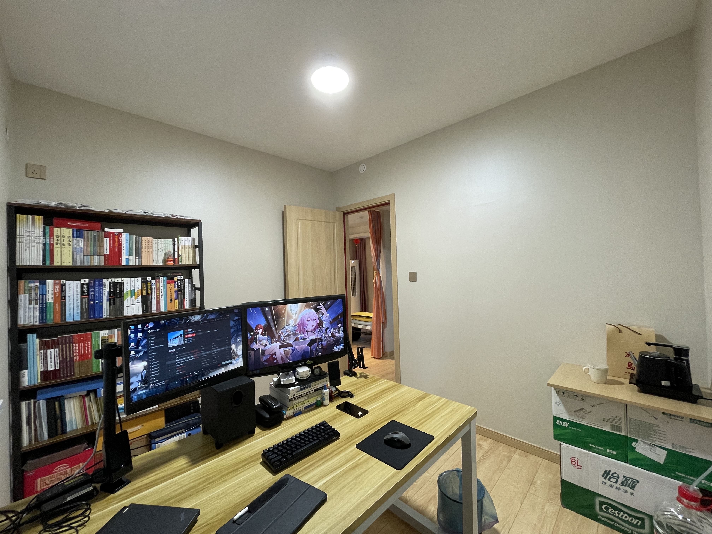
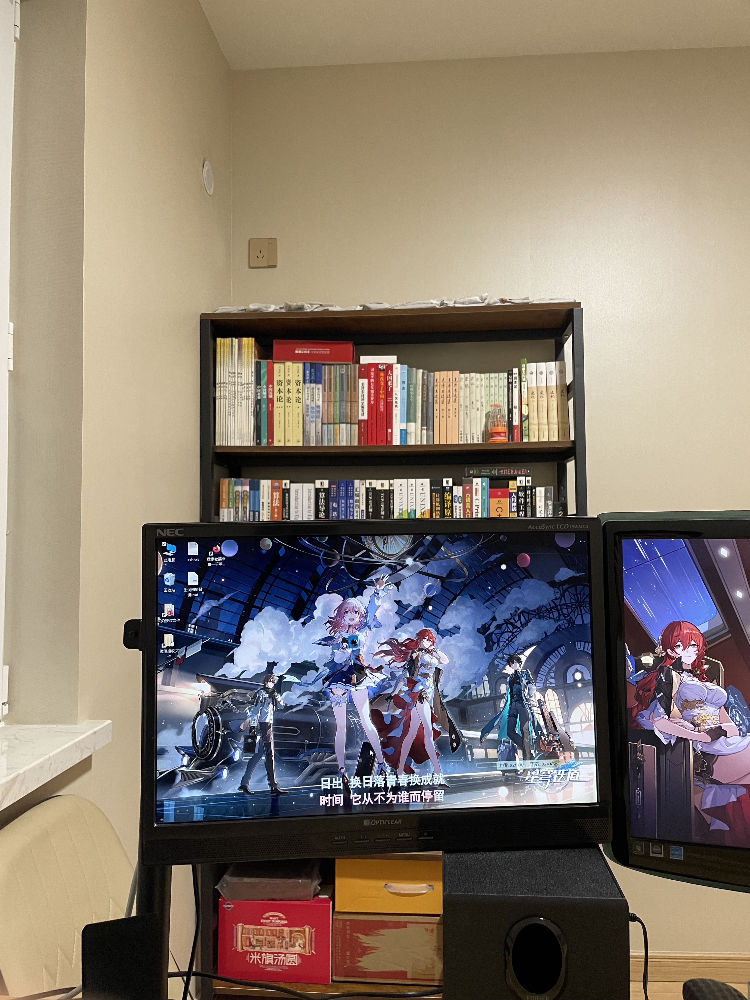

# 建设清单

> 这里记录一下生活中需要建设的各种事情。

---

### 20230602

客厅区域和书房区域都要做大面积的地毯

书房的灯光方案，免打孔的话，可以借助 `设备树（天地杆）` 这种设备来实现。

> 方钢+连接件，可以搭建出一个非常牢固的钢框架，在此基础上，可以挂隔音毯，可以加强磁台灯底座，配上射灯，既满足需求，又成本极低，还组装方便，适配性极强。

灯光大概在 `4-6` 个 `9w+`， `4000K` 的 `射灯灯泡` ，配上 `夹式台灯灯座` ，即可。

隔音方案，暂时只做一面墙，或者做半面墙，或者不做。因为根据昨天隔壁吵架的声音来判断，这个墙体的隔音确实是还可以。做隔音吸音只需要考虑录音时麦克风的要求即可（等麦克风办下来再根据效果决定）。

> （此段划掉）但考虑到隔音方案，隔音棉会损害墙面，为了之后租房的通用性（毕竟有些房主不让租客损坏墙面，且难以粘贴打孔），还是应该考虑做钢结构（方形钢管），相当于贴着墙面做了钢结构（除地面以外的五面都要做，地面铺一层薄地毯）。并且隔音棉的固定方式应采用机械方式，而不是胶水，这样有利于整体钢结构的拆装。

## 20230701

下午组装桌子，挪书架，做水吧，书房终于像样一些了。

