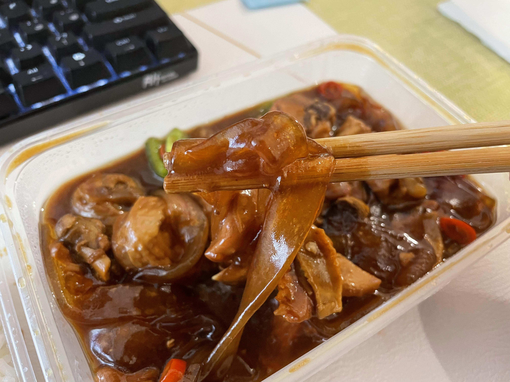
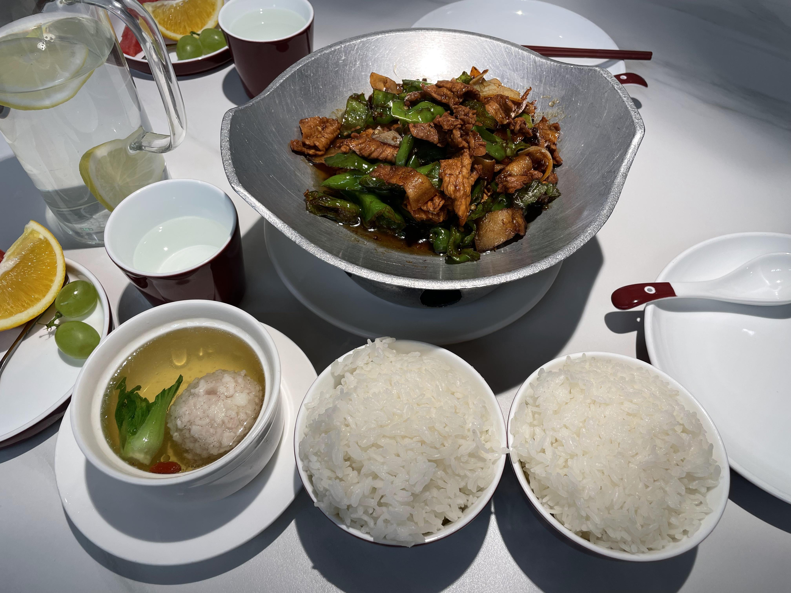
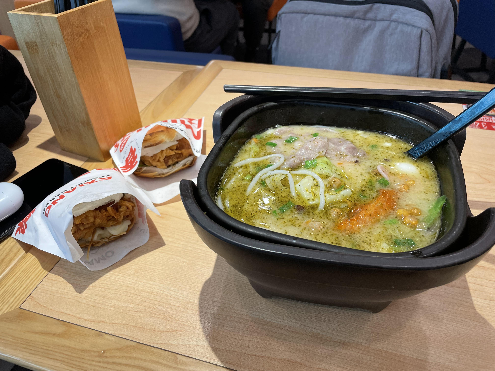

# 品尝

{:height="50%" width="50%"}

{:height="50%" width="50%"}

{:height="50%" width="50%"}

{:height="50%" width="50%"}

{:height="50%" width="50%"}

{:height="50%" width="50%"}

{:height="50%" width="50%"}

{:height="50%" width="50%"}

{:height="50%" width="50%"}

{:height="50%" width="50%"}

{:height="50%" width="50%"}

{:height="50%" width="50%"}

{:height="50%" width="50%"}

{:height="50%" width="50%"}

{:height="50%" width="50%"}

{:height="50%" width="50%"}

{:height="50%" width="50%"}

{:height="50%" width="50%"}

{:height="50%" width="50%"}

{:height="50%" width="50%"}

{:height="50%" width="50%"}

{:height="50%" width="50%"}

{:height="50%" width="50%"}

{:height="50%" width="50%"}

{:height="50%" width="50%"}

{:height="50%" width="50%"}

{:height="50%" width="50%"}

{:height="50%" width="50%"}

{:height="50%" width="50%"}

{:height="50%" width="50%"}

{:height="50%" width="50%"}

{:height="50%" width="50%"}

{:height="50%" width="50%"}

{:height="50%" width="50%"}

{:height="50%" width="50%"}

{:height="50%" width="50%"}

{:height="50%" width="50%"}

{:height="50%" width="50%"}

{:height="50%" width="50%"}

{:height="50%" width="50%"}

{:height="50%" width="50%"}

{:height="50%" width="50%"}

{:height="50%" width="50%"}

{:height="50%" width="50%"}

{:height="50%" width="50%"}

{:height="50%" width="50%"}

{:height="50%" width="50%"}

{:height="50%" width="50%"}

{:height="50%" width="50%"}

{:height="50%" width="50%"}

