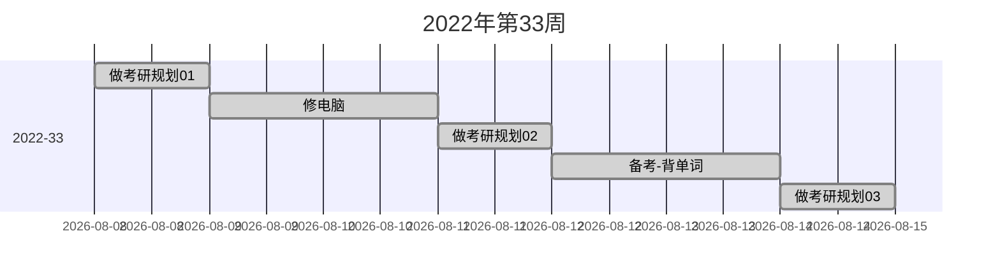

# 2022年第33周总结

> 20220808-20220814

本周完成的任务主要为：

1. 做考研规划
2. 备考初步

突发情况：

- 修电脑

### 做考研规划

本周一、三、四三天进行考研的初步规划，确定了各科目学习/复习策略，本周日对各科目作出了具体的时间安排。

### 备考初步

本周五、六开始背单词，每日平均单词量为300左右。

### 出现的突发情况

笔记本电脑（黑苹果）装了个驱动，直接开不开机，救数据救了2天。
